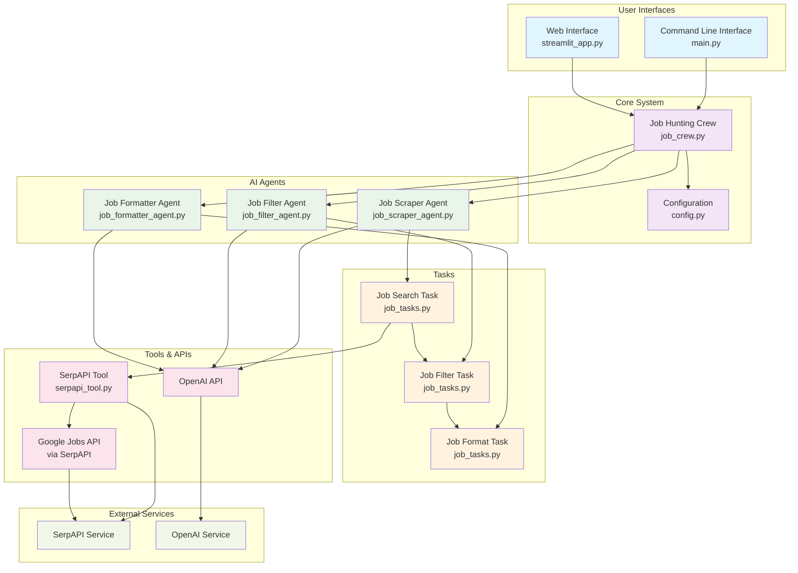

# AI Job Agent Architecture

## System Architecture Diagram

## Component Overview

### User Interfaces
- **Command Line Interface (main.py)**: CLI for automated job searching with command-line arguments
- **Web Interface (streamlit_app.py)**: Interactive web application for user-friendly job searching

### Core System
- **Job Hunting Crew (job_crew.py)**: Orchestrates the entire job search workflow using CrewAI
- **Configuration (config.py)**: Manages API keys and system configuration

### AI Agents
- **Job Scraper Agent**: Searches for job listings using SerpAPI and Google Jobs
- **Job Filter Agent**: Analyzes and filters jobs based on user preferences
- **Job Formatter Agent**: Creates professional summaries and recommendations

### Tasks
- **Job Search Task**: Handles the job scraping workflow
- **Job Filter Task**: Manages job filtering logic
- **Job Format Task**: Formats final output for users

### Tools & APIs
- **SerpAPI Tool**: Custom tool for interacting with SerpAPI
- **OpenAI API**: Provides AI capabilities for all agents
- **Google Jobs API**: Source of job listings (accessed via SerpAPI)

## Data Flow

1. **Input**: User provides job query, location, and preferences
2. **Scraping**: Job Scraper Agent searches for jobs using SerpAPI
3. **Filtering**: Job Filter Agent analyzes jobs against user preferences
4. **Formatting**: Job Formatter Agent creates final report
5. **Output**: Formatted job recommendations delivered to user

## Key Features

- **Multi-Agent Collaboration**: Three specialized agents working in sequence
- **Intelligent Filtering**: AI-powered job matching based on preferences
- **Dual Interface**: Both CLI and web interfaces available
- **Real-time Processing**: Live status updates during job search
- **Professional Output**: Structured, actionable job reports