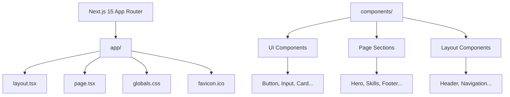
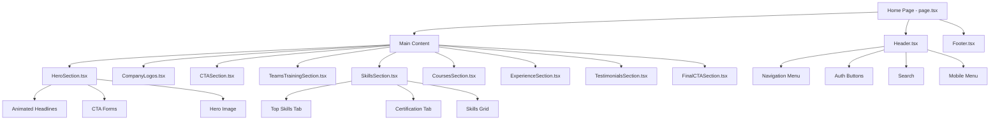
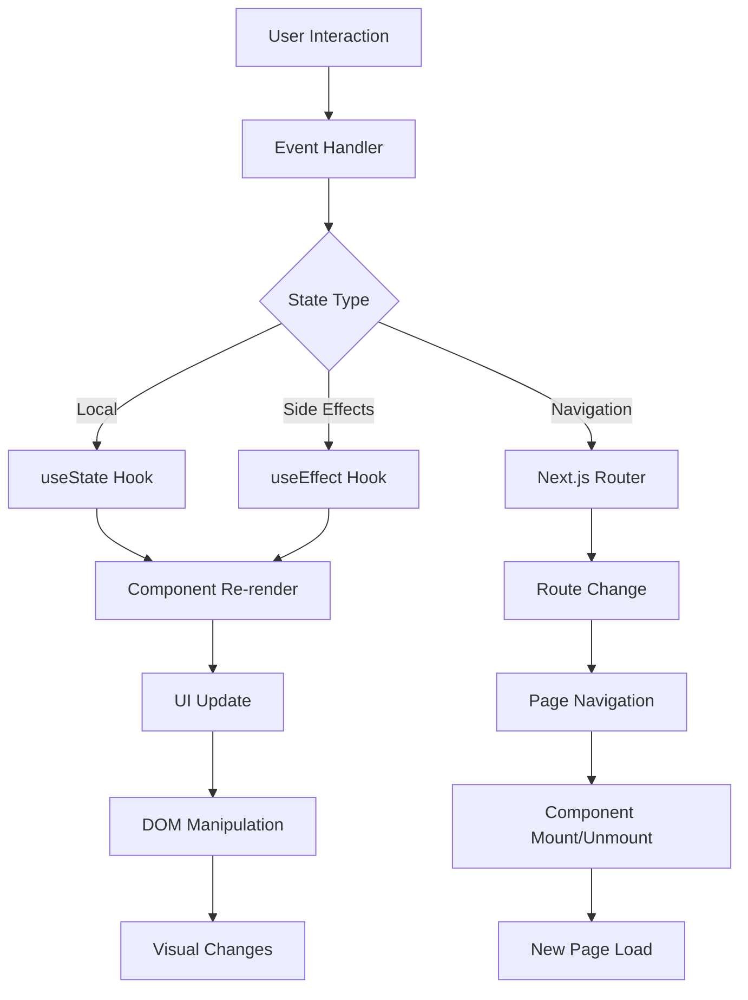
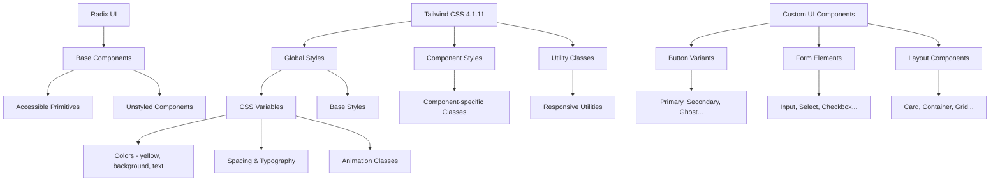
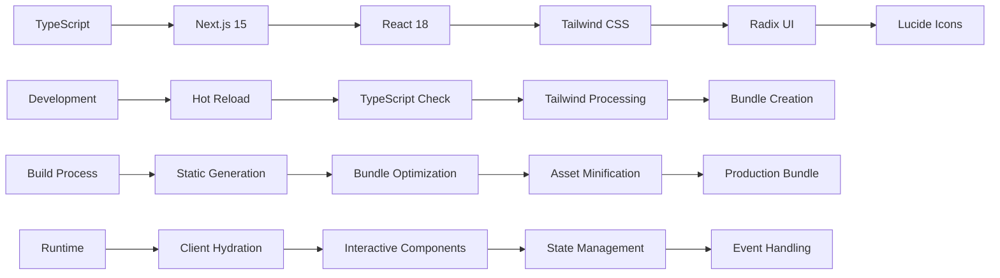
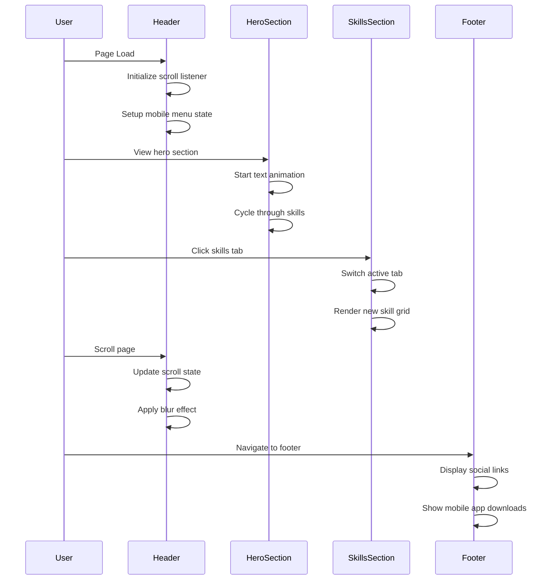
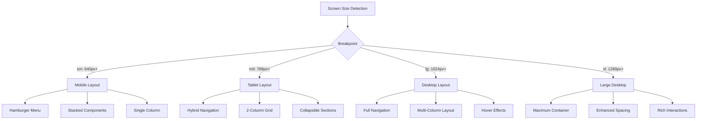
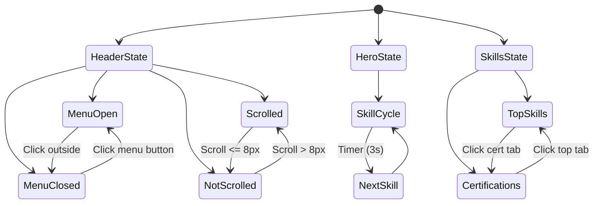

# Codecademy Web Clone - Architecture Diagram

## Project Structure

## Component Hierarchy

## Data Flow Architecture

## Styling System Architecture

## Technical Stack Flow

## User Interaction Flow

## Responsive Design Breakpoints

## Component State Management
