# Portfolio Development Process

## Step-by-Step Development Guide

This document outlines the systematic approach used to build the portfolio website, detailing the order of development and the rationale behind each step.

## Development Architecture

```mermaid
graph TB
    subgraph "1. Project Foundation"
        SETUP[Project Setup<br/>Next.js + TypeScript]
        DEPS[Dependencies<br/>Tailwind, Framer Motion, React Icons]
        CONFIG[Configuration<br/>tsconfig, next.config, tailwind]
    end
    
    subgraph "2. Core Structure"
        LAYOUT[Layout Component<br/>Navigation + Container]
        GLOBALS[Global Styles<br/>CSS Variables + Utilities]
        PAGES[Page Structure<br/>Main routing setup]
    end
    
    subgraph "3. UI Components (Order of Development)"
        HERO[Hero Section<br/>Landing + Introduction]
        ABOUT[About Section<br/>Personal Info + Stats]
        SKILLS[Skills Section<br/>Technical Abilities]
        PROJECTS[Projects Section<br/>Portfolio Showcase]
        EXPERIENCE[Experience Section<br/>Work Timeline]
        CONTACT[Contact Section<br/>Communication Form]
        FOOTER[Footer<br/>Final Touch]
    end
    
    subgraph "4. Advanced Features"
        ANIMATIONS[Framer Motion<br/>Smooth Transitions]
        RESPONSIVE[Responsive Design<br/>Mobile-First Approach]
        INTERACTIONS[User Interactions<br/>Hover Effects + Scroll]
    end
    
    %% Flow connections
    SETUP --> DEPS
    DEPS --> CONFIG
    CONFIG --> LAYOUT
    LAYOUT --> GLOBALS
    GLOBALS --> PAGES
    PAGES --> HERO
    HERO --> ABOUT
    ABOUT --> SKILLS
    SKILLS --> PROJECTS
    PROJECTS --> EXPERIENCE
    EXPERIENCE --> CONTACT
    CONTACT --> FOOTER
    FOOTER --> ANIMATIONS
    ANIMATIONS --> RESPONSIVE
    RESPONSIVE --> INTERACTIONS
    
    %% Styling
    classDef foundation fill:#e1f5fe
    classDef structure fill:#f3e5f5
    classDef components fill:#e8f5e8
    classDef advanced fill:#fff3e0
    
    class SETUP,DEPS,CONFIG foundation
    class LAYOUT,GLOBALS,PAGES structure
    class HERO,ABOUT,SKILLS,PROJECTS,EXPERIENCE,CONTACT,FOOTER components
    class ANIMATIONS,RESPONSIVE,INTERACTIONS advanced
```



## Detailed Development Steps

### Phase 1: Project Foundation (Setup & Configuration)

#### Step 1: Project Initialization
```bash
# Create Next.js project with TypeScript
npx create-next-app@latest portfolio --typescript --tailwind --app
cd portfolio
```

**Why this first?** 
- Establishes the project structure
- Sets up TypeScript for type safety
- Configures Tailwind CSS for styling
- Uses App Router for modern Next.js features

#### Step 2: Dependencies Installation
```bash
npm install framer-motion lucide-react react-icons
```

**Dependencies chosen:**
- `framer-motion`: For smooth animations and transitions
- `lucide-react`: For consistent iconography
- `react-icons`: For additional icon libraries (GitHub, LinkedIn, etc.)

#### Step 3: Configuration Files
- **tsconfig.json**: TypeScript configuration with path aliases
- **next.config.ts**: Next.js configuration for images and optimization
- **tailwind.config.js**: Custom colors, animations, and utilities

### Phase 2: Core Structure & Layout

#### Step 4: Layout Component (`components/Layout.tsx`)
```typescript
// Core features implemented:
- Fixed navigation with smooth scrolling
- Mobile-responsive hamburger menu
- Social media links sidebar
- Scroll-to-top button
- Particle background animation
```

**Why Layout first?**
- Provides the wrapper for all pages
- Establishes navigation structure
- Sets up the overall page flow
- Creates reusable UI patterns

#### Step 5: Global Styles (`app/globals.css`)
```css
// Custom CSS classes added:
- .gradient-text (for colorful text)
- .glass (for glassmorphism effect)
- .hover-glow (for interactive elements)
- .smooth-transition (for consistent animations)
```

#### Step 6: Main Page Structure (`app/page.tsx`)
```typescript
// Page composition:
<Layout>
  <HeroSection />
  <AboutSection />
  <SkillsSection />
  <ProjectsSection />
  <ExperienceSection />
  <ContactSection />
  <Footer />
</Layout>
```

### Phase 3: Component Development (Sequential Order)

#### Step 7: Hero Section (`components/HeroSection.tsx`)
**Why Hero first?**
- First impression for visitors
- Establishes visual design language
- Contains key personal branding elements

**Key features implemented:**
- Animated profile image with gradient border
- Typewriter effect for role descriptions
- Call-to-action buttons
- Statistics showcase
- Smooth scroll indicator

**Technologies used:**
- Framer Motion for animations
- Next.js Image component for optimization
- Custom CSS for gradient effects

#### Step 8: About Section (`components/AboutSection.tsx`)
**Why About second?**
- Provides context after the introduction
- Builds on Hero's visual patterns
- Establishes personal story

**Components built:**
- Personal information card
- Journey description
- Statistics grid
- Feature highlights grid

**Design patterns established:**
- Glass morphism cards
- Hover effects
- Grid-based layouts

#### Step 9: Skills Section (`components/SkillsSection.tsx`)
**Why Skills third?**
- Demonstrates technical capabilities
- Uses established card patterns
- Shows progression in abilities

**Features implemented:**
- Technology categorization
- Skill level indicators
- Interactive hover effects
- Progress bars or rating systems

#### Step 10: Projects Section (`components/ProjectsSection.tsx`)
**Why Projects fourth?**
- Showcases practical applications
- Demonstrates skills in action
- Provides portfolio evidence

**Components created:**
- Project cards with images
- Technology tags
- Live demo and GitHub links
- Filtering capabilities

#### Step 11: Experience Section (`components/ExperienceSection.tsx`)
**Why Experience fifth?**
- Shows professional growth
- Builds credibility
- Demonstrates career progression

**Features built:**
- Timeline component (`ui/ExperienceTimeline.tsx`)
- Company information
- Role descriptions
- Achievement highlights

#### Step 12: Contact Section (`components/ContactSection.tsx`)
**Why Contact sixth?**
- Provides clear next steps
- Encourages user interaction
- Completes the user journey

**Components implemented:**
- Contact form
- Social media links
- Direct communication options
- Location information

#### Step 13: Footer (`components/Footer.tsx`)
**Why Footer last?**
- Provides final touchpoint
- Contains secondary information
- Completes the page structure

### Phase 4: Advanced Features & Polish

#### Step 14: Animation Implementation
**Framer Motion integration:**
- Page load animations
- Scroll-triggered animations
- Hover interactions
- Smooth transitions

#### Step 15: Responsive Design
**Mobile-first approach:**
- Breakpoint optimization
- Touch-friendly interactions
- Performance considerations
- Cross-device testing

#### Step 16: User Experience Enhancements
**Interactive elements:**
- Smooth scrolling navigation
- Loading states
- Error handling
- Accessibility features

## Key Development Principles

### 1. **Component-First Architecture**
- Each section is a self-contained component
- Reusable UI patterns
- Clear separation of concerns

### 2. **Progressive Enhancement**
- Start with basic functionality
- Add animations and interactions
- Optimize for performance

### 3. **Mobile-First Development**
- Design for mobile screens first
- Scale up for larger displays
- Touch-friendly interactions

### 4. **Performance Optimization**
- Image optimization with Next.js
- Code splitting
- Lazy loading
- Minimal dependencies

### 5. **User Experience Focus**
- Smooth animations
- Clear navigation
- Fast loading times
- Accessibility compliance

## Technologies & Tools Used

### Core Technologies
- **Next.js 15**: React framework with App Router
- **TypeScript**: Type safety and developer experience
- **Tailwind CSS**: Utility-first CSS framework

### UI & Animation Libraries
- **Framer Motion**: Animation library
- **React Icons**: Icon components
- **Lucide React**: Additional icons

### Development Tools
- **ESLint**: Code linting
- **PostCSS**: CSS processing
- **Bun**: Package manager and runtime

## File Structure
```
portfolio/
├── app/
│   ├── globals.css          # Global styles and utilities
│   ├── layout.tsx           # Root layout
│   └── page.tsx             # Main page composition
├── components/
│   ├── Layout.tsx           # Navigation and page wrapper
│   ├── HeroSection.tsx      # Landing section
│   ├── AboutSection.tsx     # Personal information
│   ├── SkillsSection.tsx    # Technical abilities
│   ├── ProjectsSection.tsx  # Portfolio showcase
│   ├── ExperienceSection.tsx # Work timeline
│   ├── ContactSection.tsx   # Communication form
│   ├── Footer.tsx           # Page footer
│   └── ui/
│       └── ExperienceTimeline.tsx # Timeline component
├── public/                  # Static assets
└── configuration files
```

## Best Practices Implemented

1. **Code Organization**: Logical component structure
2. **Performance**: Image optimization and lazy loading
3. **Accessibility**: Semantic HTML and ARIA labels
4. **SEO**: Meta tags and structured data
5. **Responsive Design**: Mobile-first approach
6. **Animation**: Smooth and purposeful motion
7. **User Experience**: Intuitive navigation and interactions

## Future Enhancements

1. **Blog Integration**: Add content management
2. **Dark Mode**: Theme switching capability
3. **Analytics**: User behavior tracking
4. **CMS Integration**: Dynamic content management
5. **Performance Monitoring**: Real-time metrics
6. **Testing**: Unit and integration tests

---

This development process ensures a systematic, maintainable, and scalable approach to building a professional portfolio website.